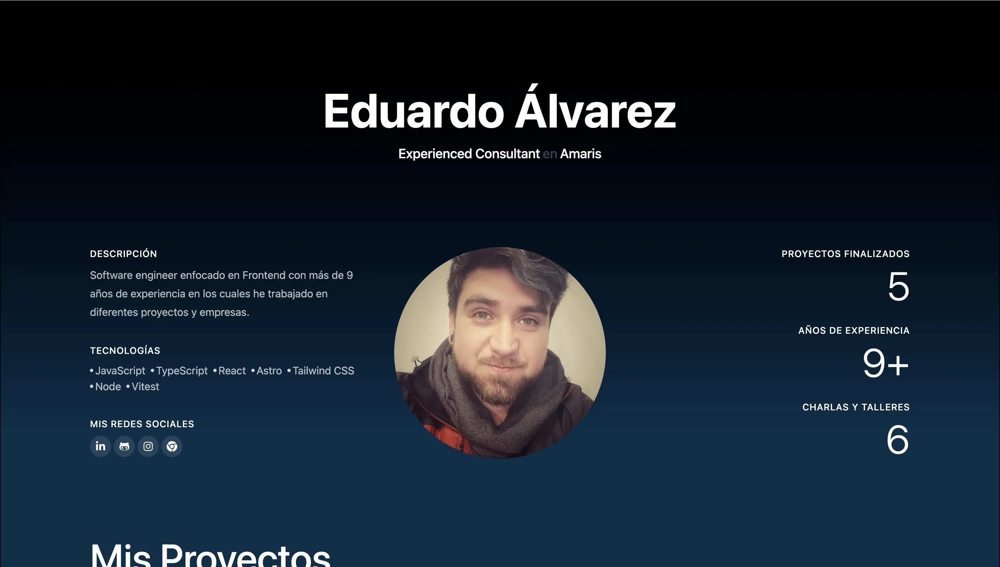

# Taller: Creando tu Página de Enlaces Personales con Astro y Tailwind CSS 🚀



## 👋 ¡Bienvenido/a al Taller!

¡Hey! Es un honor para mi que te unas a este taller donde construiremos juntos una página personal de enlaces utilizando tecnologías web modernas y muy demandadas: **Astro** y **Tailwind CSS**.

Este taller está diseñado para que aprendas:

- Cómo **Astro** nos permite construir sitios web rápidos y optimizados con una excelente experiencia de desarrollo.
- Cómo utilizar **Tailwind CSS** para diseñar interfaces de usuario de forma eficiente y personalizable mediante clases de utilidad.

No importa si estás comenzando en el mundo del desarrollo web o si ya tienes experiencia, ¡hay algo para todos!

**Público Objetivo:**

- **Principiantes:** Aprenderás los fundamentos de Astro, cómo se estructura un proyecto web y cómo aplicar estilos básicos con Tailwind CSS.
- **Intermedios:** Profundizarás en la creación de componentes reutilizables en Astro, el uso avanzado de utilidades de Tailwind y la integración de TypeScript para tipar tus componentes y datos.

---

## 🎯 Objetivos de Aprendizaje

Al finalizar este taller, serás capaz de:

- Comprender la arquitectura de Astro (Componentes `.astro`, Páginas, Layouts) y sus beneficios.
- Estructurar un proyecto web con Astro.
- Crear componentes reutilizables y dinámicos en Astro.
- Aplicar estilos de forma eficiente y responsiva utilizando las clases de utilidad de Tailwind CSS.
- Entender los fundamentos de TypeScript y cómo utilizarlo para mejorar la calidad de tu código en un proyecto Astro.
- Construir una página de enlaces personales funcional y estilizada.
- Desplegar tu proyecto en una plataforma gratuita como github pages.

---

## 🛠️ Requisitos Previos

Para aprovechar al máximo este taller, te recomendamos tener:

### Conocimientos Previos 🧠

- **Nivel Básico:**
  - Manejo básico de una computadora y navegación por internet.
  - Comprensión fundamental de HTML (qué son las etiquetas) y CSS (qué son los selectores y propiedades básicas).
  - ¡Muchas ganas de aprender!
- **Nivel Intermedio (Recomendado para ciertas secciones):**
  - Familiaridad con la sintaxis básica de JavaScript (variables, funciones, arrays, objetos).
  - Experiencia básica con la línea de comandos o terminal.

### Software Necesario 💻

Asegúrate de tener instalado el siguiente software antes de comenzar:

1.  **Editor de Código:**
    - Visual Studio Code (Recomendado, con la extensión oficial de Astro y Tailwind CSS IntelliSense).
2.  **Navegador Web Moderno:**
    - Google Chrome
    - Mozilla Firefox
3.  **Node.js y npm**:
    - Se recomienda la versión LTS (Long Term Support). Puedes verificar tu versión abriendo tu terminal y ejecutando: `node -v` y `npm -v`.
4.  **Git**: Para control de versiones y clonar el repositorio.
    - Verifica con: `git --version`.

---

**Navegación del Taller:**

- **Módulo 1**: Introducción a Astro y configuración del entorno.
- **Módulo 2**: Creando la estructura: Layouts y Páginas.
- **Módulo 3**: Componentes re-utilizables en Astro (con TypeScript).
- **Módulo 4**: Estilizando con la magia de tailwind.
- **Módulo 5**: Añadiendo tus enlaces y personalización.
- **Módulo 6**: Despliegue.

---

## 🚀 Instrucciones de Configuración e Instalación

Sigue estos pasos para poner en marcha el proyecto en tu máquina local:

1.  **Clona el Repositorio:**
    Abre tu terminal o Git Bash y ejecuta:

    ```bash
    git clone https://github.com/Proskynete/taller-my-social-networks.git
    cd taller-my-social-networks
    ```

2.  **Instala las Dependencias:**
    Este proyecto usa `npm` para gestionar sus dependencias.

    ```bash
    npm install
    ```

    _(Si prefieres `yarn` o `pnpm`, puedes usar `yarn install` o `pnpm install` respectivamente)._

3.  **Ejecuta el Servidor de Desarrollo:**
    Astro viene con un servidor de desarrollo integrado que se actualiza automáticamente cuando haces cambios.

    ```bash
    npm run dev
    ```

    Esto iniciará el servidor (usualmente en `http://localhost:4321`). Abre esta URL en tu navegador para ver el proyecto. La terminal te mostrará la URL exacta.

---

## 📜 Licencia

Este proyecto de taller se distribuye bajo la Licencia **MIT**.

---

## 🧑‍💻 Autores y Agradecimientos

- **Eduardo Álvarez**.
  - [Tu GitHub/LinkedIn/Twitter (opcional)]
- **TechSchool**.
  - [Tu GitHub/LinkedIn/Twitter (opcional)]

---

¡Espero que hayas disfrutado y sobre todo, que hayas aprendido mucho en este taller! Si tienes alguna duda durante el taller, solo debes preguntar.

¡Feliz codificación! 🎉
